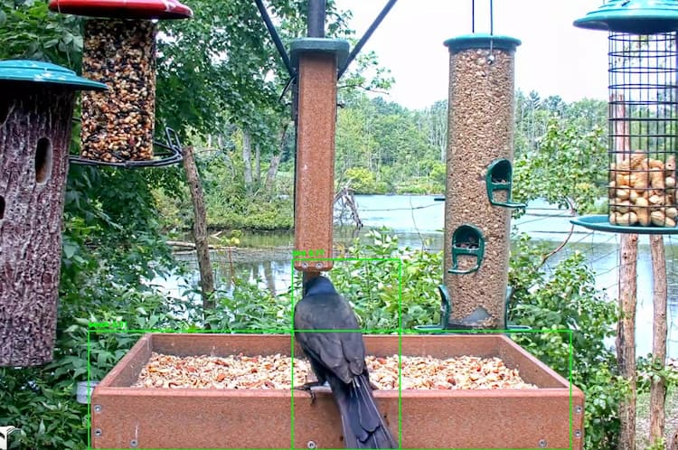

# RealTimeYOLO 🔴 YouTube Live


This repository contains two implementations of object detection using YOLOv5 and YOLOv8 models to analyze live streams from YouTube. 

The application uses Flask to create a web server that streams the video feed and displays the detected objects. It serves as a launching point to begin object detection or to train your own models on your own data. For more information on training YOLO models, check out the [Ultralytics training guide](https://docs.ultralytics.com/modes/train/).

## Table of Contents
- [RealTimeYOLO](#yolo-stream-detection)
  - [Table of Contents](#table-of-contents)
  - [Repository Structure](#repository-structure)
  - [Installation](#installation)
  - [Usage](#usage)
    - [YOLOv5](#yolov5)
    - [YOLOv8](#yolov8)
  - [Acknowledgments](#acknowledgments)
  - [Contributing](#contributing)
  - [License](#license)
  - [Contact](#contact)

## Repository Structure

```plaintext
├── yolov5
│   ├── app.py
│   ├── models
│   │   └── yolov5nu.pt
│   ├── stream.py
│   ├── templates
│   │   └── index.html
│   └── utils
│       ├── get_model.py
│       └── model_info.py
└── yolov8
    ├── app.py
    ├── models
    │   └── yolov8n.pt
    ├── stream.py
    ├── templates
    │   └── index.html
    ├── track.py
    └── utils
        ├── bytetrack.yaml
        ├── get_model.py
        └── model_info.py
```

## Installation

1. **Clone the repository:**
    ```bash
    git clone https://github.com/yourusername/yolo-stream-detection.git
    cd yolo-stream-detection
    ```

2. **Install the required dependencies:**
    ```bash
    pip install -r requirements.txt
    ```

3. **Download the YOLO models and place them in the respective folders:**
    - YOLOv5: Run get_model.py in the yolov5/utils/ folder.
    - YOLOv8: Run get_model.py in the yolov8/utils/ folder.

## Usage

This repository provides a way to view (`stream.py`) and perform object detection (`app.py`) on YouTube Live Streams.

### YOLOv5

1. **Navigate to the `yolov5` directory:**
    ```bash
    cd yolov5
    ```

2. **Run the application:**
    ```bash
    python app.py
    ```

3. **Access the live stream with detections:**
    Open a browser and go to `http://localhost:5000`.

### YOLOv8

1. **Navigate to the `yolov8` directory:**
    ```bash
    cd yolov8
    ```

2. **Run the application:**
    ```bash
    python app.py
    ```

3. **Access the live stream with detections:**
    Open a browser and go to `http://localhost:5000`.

### Additional Scripts

- **Download Models:** 
    You can run `get_model.py` in the `utils` folder to download the models to the `models` folder.
    ```bash
    python utils/get_model.py
    ```

- **Model Information:**
    You can run `model_info.py` to get detailed info about the model, including the classes and class IDs.
    ```bash
    python utils/model_info.py
    ```

- **Object Counting:**
    In the `yolov8` folder, there is a `track.py` script. This is a basic implementation of object counting in YOLO. Refer to the [Ultralytics documentation](https://docs.ultralytics.com/guides/object-counting) for more information.
    ```bash
    python track.py
    ```

## Acknowledgments

This project uses [CamGear from Vidgear](https://abhitronix.github.io/vidgear/latest/gears/camgear/usage/#using-camgear-with-youtube-videos) by Abhitronix as the foundation for streaming YouTube live videos. For more information, visit the [Vidgear documentation](https://abhitronix.github.io/vidgear/latest/).

The YouTube streams used in this project are:
- [Live Birds In 4K! Cornell Lab FeederWatch Cam at Sapsucker Woods](https://www.youtube.com/live/x10vL6_47Dw?si=5zUvLbDtBAzlzRcD)
- [LIVE Bird Feeder and Wildlife Cam (4K) Gettysburg PA, over 30 species identified](https://www.youtube.com/live/2uabwdYMzVk?si=dYSeZPoy1Y-lQXI8)

## Contributing

1. Fork the repository.
2. Create a new branch: `git checkout -b my-feature-branch`.
3. Make your changes and commit them: `git commit -m 'Add some feature'`.
4. Push to the branch: `git push origin my-feature-branch`.
5. Submit a pull request.

## License

This project is licensed under the MIT License. See the [LICENSE](LICENSE) file for details.

## Contact

For any questions or comments, please contact [Ray](mailto:ray@cybersavvy.one).
